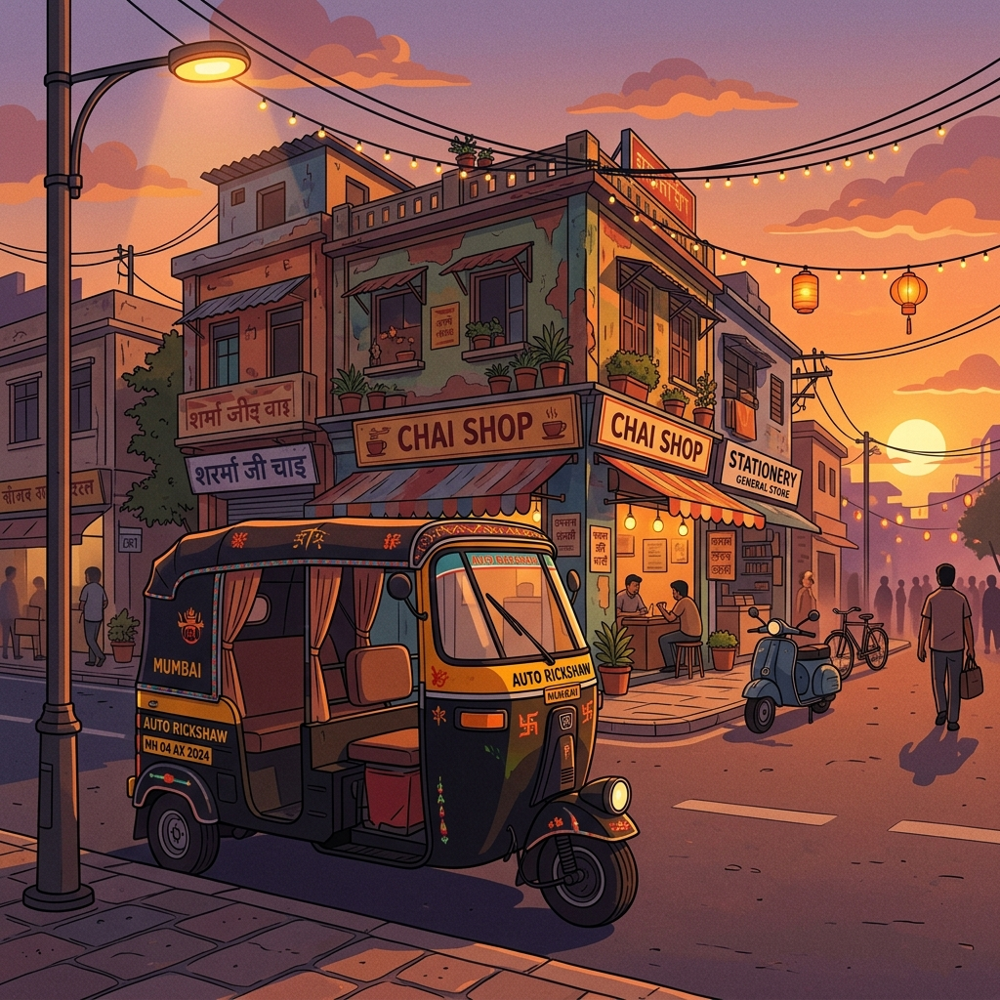

# 📻 Desi Lofi Radio

> *A nostalgic, immersive Indian lofi music experience — straight from the streets.*



---

## 🎵 About

**Desi Lofi Radio** is a beautiful, single-page music web app that brings the soul of Indian street culture to life through lofi music and stunning visuals. Switch between stations, each with its own cinematic illustration, Hindi typography, and curated playlist.

Built with pure **HTML, CSS & JavaScript** — no frameworks, no bloat.

---

## 🏪 Stations

| Station | Vibe | Hindi |
|---|---|---|
| 🛺 Auto Wala | Highway Vibes | ऑटो वाला |
| 🔧 Raju Mistri | Garage Sessions | राजू मिस्त्री |
| ✂️ Deluxe Saloon | Open All Hours | डीलक्स सैलून |
| 🚌 Bus Driver | Night Route 241 | बस ड्राइवर |
| ☕ Chai Tapri | Midnight Brew | चाय टपरी |
| 🚆 Local Train | Last Train Home | लोकल ट्रेन |

---

## ✨ Features

- 🎶 **Real music playback** via YouTube IFrame API
- 🎨 **6 unique visual themes** — each station has its own AI-generated illustration
- 📋 **Interactive playlist panel** — click any track to jump to it
- 🎛️ **Full player controls** — Play/Pause, Next/Prev, seek bar, volume slider, mute
- 🌀 **Smooth animations** — cinematic background pan, floating UI, spinning vinyl album art
- 💎 **Glassmorphism UI** — blurred, translucent music player widget
- 📱 **Fully responsive** — works on mobile, tablet & desktop
- 🔤 **Hindi typography** using Google Fonts (Yatra One)

---

## 🚀 Getting Started

### Option 1 — Open directly
Just download and open `index.html` in your browser. *(Note: YouTube audio works best when served from a server, not directly as a file.)*

### Option 2 — Run a local server (recommended)
```bash
npx serve . -l 3000
```
Then open **[http://localhost:3000](http://localhost:3000)**

---

## 🛠️ Tech Stack

| Technology | Usage |
|---|---|
| HTML5 | Structure |
| CSS3 | Styling, animations, glassmorphism |
| Vanilla JavaScript | Player logic, theme switching |
| YouTube IFrame API | Real music streaming |
| Google Fonts | Yatra One (Hindi), Inter (UI) |
| Phosphor Icons | UI icons |

---

## 📁 File Structure

```
desi-lofi-radio/
├── index.html       ← Main app (all HTML, CSS, JS)
├── bg.jpg           ← Auto Wala background
├── mechanic.jpg     ← Raju Mistri background
├── barber.jpg       ← Deluxe Saloon background
├── bus.jpg          ← Bus Driver background
├── chai.jpg         ← Chai Tapri background
└── README.md
```

---

## 🎨 Design Inspiration

Inspired by websites like:
- **Raju Mistri Playlist** (`raju-mistri-playlist.pages.dev`)
- **Baap Ki Sadak** — rickshaw radio vibes
- **Deluxe Saloon** (`deluxesalon.in`)

The design philosophy: *Bold Hindi typography + cinematic Indian street illustrations + modern glassmorphism UI.*

---

## 👤 Author

**Dushyant** — [@eyespydushyant](https://github.com/eyespydushyant)

---

